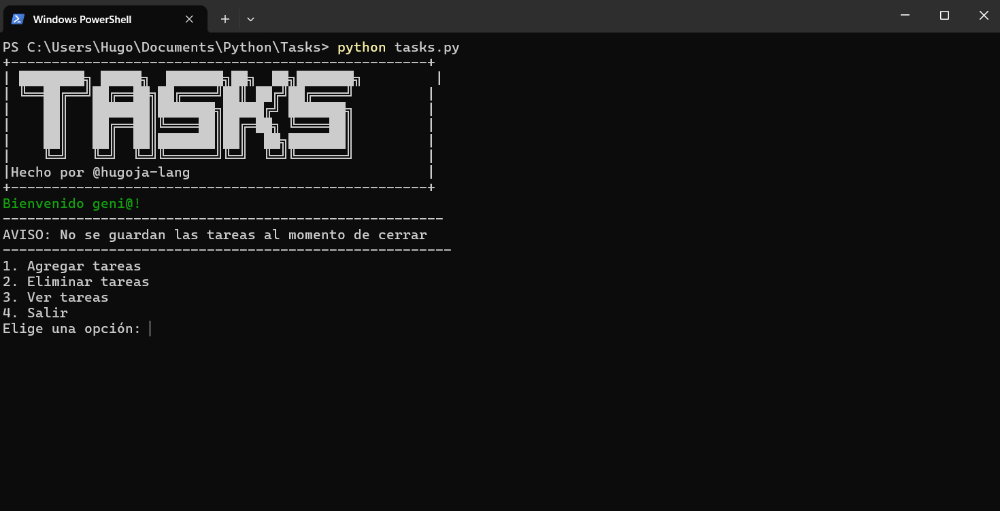

# Gestor de Tareas en Terminal

Simple gestor de tareas creado en Python que se ejecuta en la terminal. Permite al usuario agregar, ver y eliminar tareas.

# Prerrequisitos 📋
Necesitas tener Python 3 instalado en tu sistema para poder ejecutar este programa.

# En Windows 🖼️
Ve a la página oficial de descargas de Python: python.org/downloads/

Descarga el instalador más reciente para Windows.

Ejecuta el instalador. ¡MUY IMPORTANTE! En la primera pantalla de la instalación, asegúrate de marcar la casilla de abajo que dice "Add Python to PATH".

Continúa con la instalación normal.

Para verificar que se instaló correctamente, abre una nueva terminal (CMD o PowerShell) y escribe python --version. Deberías ver la versión que instalaste.

# En macOS 🍎
La forma recomendada es usar el gestor de paquetes Homebrew.

Abre la aplicación Terminal.

Instala Homebrew si aún no lo tienes (en su página web te dan el comando para copiar y pegar).

Una vez instalado Homebrew, escribe el siguiente comando en la terminal:

Bash

brew install python
Para verificar la instalación, escribe: python3 --version.

# En Linux (Debian/Ubuntu) 🐧
La mayoría de las distribuciones de Linux modernas ya incluyen Python 3. Puedes asegurarte de tenerlo con estos pasos.

Abre una terminal.

Primero, actualiza la lista de paquetes de tu sistema:

Bash

sudo apt update
Luego, instala Python 3 (si no lo tienes ya):

Bash

sudo apt install python3
Para verificar la instalación, escribe: python3 --version.

## Cómo ejecutarlo
1. Asegúrate de tener Python 3 instalado.
2. Abre una terminal en la carpeta donde se encuentra el archivo .py.
3. Ejecuta el comando: `python tasks.py`
